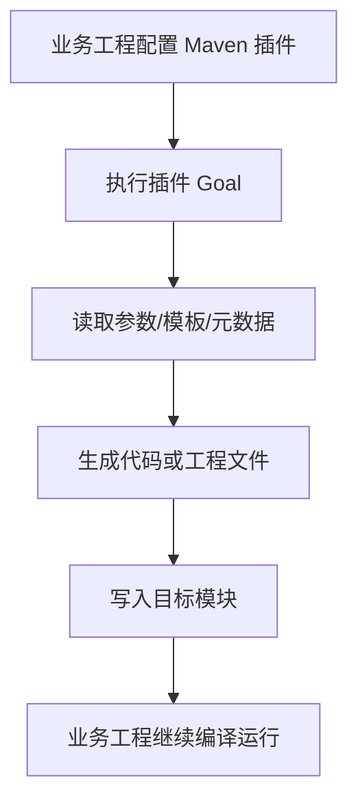



  

# g2rain-generator-maven-plugin

下一代AI软件开发范式，AI原生Agent平台，开源的企业级SaaS底座。

g2rain 后端代码生成与 Maven 插件，面向后端工程提供代码生成、工程约定落地与构建期自动化能力；作为平台后端研发支撑层被多个 g2rain 服务复用

[官网](https://www.g2rain.com) · [Issues](https://github.com/g2rain/g2rain/issues) · [Discussions](https://github.com/g2rain/g2rain/discussions)

## 目录

- 项目简介
- 平台定位
- 业务域说明
- 功能概览
- 使用场景
- 核心流程
- 流程图
- 技术栈
- 环境要求
- 快速开始
- 构建与镜像
- 插件使用
- 安全说明
- 与关联仓库的关系
- 模块说明
- 职责边界
- 常见问题
- 关联仓库
- 参与贡献
- 许可证
- 联系我们
- 致谢

## 项目简介

g2rain 后端代码生成与 Maven 插件，面向后端工程提供代码生成、工程约定落地与构建期自动化能力；作为平台后端研发支撑层被多个 g2rain 服务复用

## 平台定位

该仓库位于 g2rain 后端研发支撑层，为多个后端项目提供集成能力、工程化工具或共享扩展。

## 业务域说明

该仓库聚焦于 `后端代码生成、Maven 插件与工程化自动化`。

## 功能概览

| 能力 | 说明 |
| --- | --- |
| 构建期生成 | 通过 Maven 插件目标在构建或开发阶段生成代码、配置或工程骨架。 |
| 工程规范落地 | 将平台后端代码结构、命名约定和模板规则固化到插件流程中。 |

## 使用场景

| 场景 | 说明 |
| --- | --- |
| 生成后端代码 | 当开发者需要根据模板或元数据生成 Controller、Service、DTO、实体或配置文件时使用。 |
| 降低重复工程搭建 | 当新模块需要快速落地 g2rain 后端结构和命名规范时，通过 Maven 插件完成自动化生成。 |

## 核心流程

| 流程 | 关键步骤 | 代码线索 |
| --- | --- | --- |
| 代码生成流程 | 在业务工程配置 Maven 插件 → 执行插件目标或构建阶段 → 读取模板、元数据或用户参数 → 生成代码与配置文件 → 开发者在业务工程中继续扩展 | pom.xml、maven-plugin-plugin、Mojo、template/generator classes |

## 流程图

## 技术栈

| 类别 | 说明 |
| --- | --- |
| 运行时 | Java 25 |
| 其他 | Lombok |

## 环境要求

- JDK 25+
- Maven 3.9+

## 快速开始

| 步骤 | 命令或位置 | 说明 |
| --- | --- | --- |
| 准备构建环境 | JDK 25+、Maven 3.9+ | 工具组件通常只需要 Java 与 Maven 构建环境。 |
| 构建组件 | `mvn clean package` | 执行 Maven 构建，生成可发布或可本地安装的组件产物。 |
| 本地安装 | `mvn clean install` | 安装到本地 Maven 仓库，便于业务工程试用插件目标。 |

版本号以项目构建配置为准，当前识别为 `1.0.6`。

## 构建与镜像

| 目标 | 命令 | 产物 | 说明 |
| --- | --- | --- | --- |
| 组件产物 | `mvn clean package` | `g2rain-generator-maven-plugin-1.0.6.jar` | 执行 Maven 标准构建，生成可发布的 Maven 插件产物。 |
| 本地 Maven 安装 | `mvn clean install` | `本地 Maven 仓库产物` | 安装到本地 Maven 仓库，便于业务工程本地验证插件目标。 |

## 插件使用

| 目标 | 方式 | 命令 | 说明 |
| --- | --- | --- | --- |
| Maven 插件配置 | Maven | `<plugin><groupId>com.g2rain</groupId><artifactId>g2rain-generator-maven-plugin</artifactId><version>1.0.6</version></plugin>` | 在业务工程 pom.xml 的 plugins 中配置该 Maven 插件。 |
| 执行插件目标 | Maven Goal | `mvn com.g2rain:g2rain-generator-maven-plugin:1.0.6:generate` | 在业务工程中执行插件目标，触发代码生成或工程处理逻辑。 |

## 安全说明

| 主题 | 说明 |
| --- | --- |
| 依赖可信边界 | 作为平台共享组件或构建工具，应通过组织 Maven 仓库、版本锁定和发布流程控制依赖来源。 |
| 生成文件审计 | 代码生成或项目初始化工具会写入工程文件，执行前应确认模板来源、输出目录和覆盖策略。 |

## 与关联仓库的关系

本仓库位于 g2rain 后端研发支撑层，通过 Maven 插件目标和代码生成规则支撑后端工程创建与演进。

## 模块说明

| 模块 | 职责说明 | 代码线索 |
| --- | --- | --- |
| 插件 Goal | 暴露 Maven 插件执行入口，承载生成或工程处理动作。 | Mojo、maven-plugin-plugin、plugin descriptor |
| 生成器核心 | 读取模板、参数或元数据并生成目标代码。 | generator、template、codegen classes |

## 职责边界

该仓库主要负责：
- 负责提供 Maven 插件目标、代码生成流程和工程化自动化能力
- 负责将平台后端模板、命名约定和生成规则落地到业务工程

该仓库默认不负责：
- 不负责生成后代码的业务语义正确性
- 不替代业务服务的测试、联调和上线验证

## 常见问题

| 问题 | 可能原因 | 处理建议 |
| --- | --- | --- |
| 业务工程无法解析依赖 | 组件未发布到当前 Maven 仓库，或 groupId/artifactId/version 配置不一致。 | 检查 Maven 仓库地址、版本号和业务工程 dependencyManagement 配置。 |
| 插件目标执行失败 | 插件参数、模板路径、输出目录或 Maven 生命周期配置不正确。 | 检查插件 goal、configuration、模板资源和构建日志。 |

## 关联仓库

| 仓库 | 协作关系 |
| --- | --- |
| g2rain-common | 复用平台公共规范、通用模型、工具能力或基础依赖约束。 |

## 参与贡献

我们欢迎所有形式的贡献：Issue 反馈、文档改进、功能建议与代码提交。

推荐流程：

1. Fork 本仓库。
2. 创建特性分支：`git checkout -b feature/your-feature-name`。
3. 提交更改：`git commit -m "Add some feature"`。
4. 推送分支：`git push origin feature/your-feature-name`。
5. 提交 Pull Request。

代码贡献前请尽量补充必要的测试和文档，并确保构建、测试与静态检查通过。

## 许可证

本项目基于 [Apache 2.0许可证](https://github.com/g2rain/g2rain-common/blob/main/LICENSE) 开源。

## 联系我们

- Issues: [GitHub Issues](https://github.com/g2rain/g2rain/issues)
- 讨论: [GitHub Discussions](https://github.com/g2rain/g2rain/discussions)
- 邮箱: g2rain_developer@163.com

## 致谢

感谢所有为 g2rain 项目提交 Issue、代码、文档、建议和使用反馈的开发者们！
